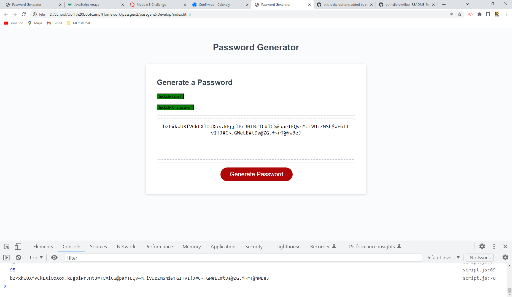

# Password Generator 
## About the Project
This is a password generator that allows the random generation of 8 to 128 characters with button selections to add Capital letters in the password and to add a select group of Symbols.

./Develop/passgenscreenshot.png

## Built with
VS Code
image captured through photoshop

## How to use
Website:
Source code for completed Password Generator available: https://github.com/rethissunstar/passgen2

## Contribution
source code from https://github.com/coding-boot-camp/friendly-parakeet

## License
License is under the MIT license

## Acknowledgements
w3schools is a lifesaver